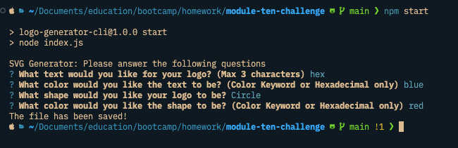
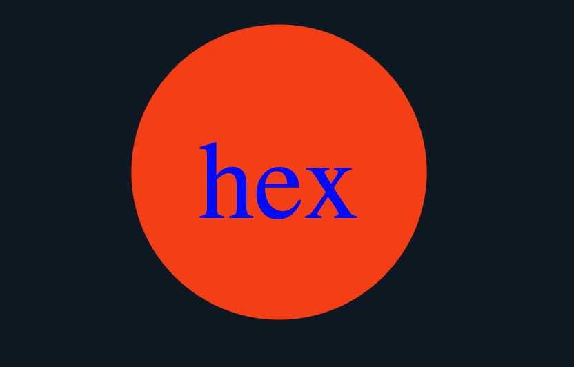
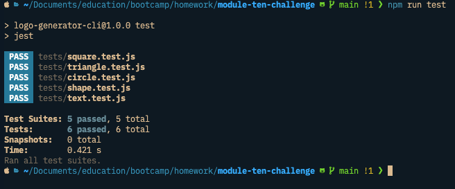

# Logo Generator

Ryan Hanzel

Module Ten | Bootcamp @ UT Austin

## Description

This is a simple SVG Generator CLI application the prompts the user for an input of three letters, the colors of the letters, one of three shapes (circle, square, triangle), and the color of the shape. The user can use both color keywords and hex. The output will render the users input on a svg canvas inside the applications root directory.

## Usage

To start the application run 'npm start' inside of the applications root directory.

- You will then be prompted for text: Enter three characters.
- You will then be prompted for text color: Enter the color keyword or a hexadecimal number.
- You will then be presented with a list of shapes: Choose either circle, triangle, or square.
- You will then be prompted for the shape's color: Enter the color keyword or hexadecimal number.
- A SVG file will be created in the applications root directory called 'logo.svg' that has a canvas of 300x200 pixels.

To test the application you may run 'npm run test' inside of the applications root directory.

## Links

Repository: [GitHub](https://github.com/H3Xivall/logo-generator-cli)

## Screenshots

